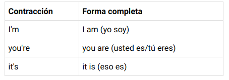
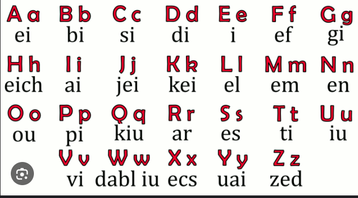

# Pendiente 
* Cúales son los articulos?

# Frases importantes
**how do you say..,?** como se dice...?

# Alfabeto

# An and a
El artículo indeterminado 'an' se utiliza delante de sustantivos que empiezan por vocal (a, e, i, o, u). Para los sustantivos que empiezan por consonante, se utiliza el artículo 'a'.

Los artículos 'a ' y 'an' no tienen forma plural.

camisilla 
pantaloneta
descalso
handkerchief: bufanda
loudspeaker: parlante
hear: escuchar
hurt: lesión 
gripa: flur

