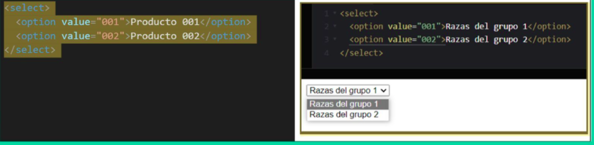
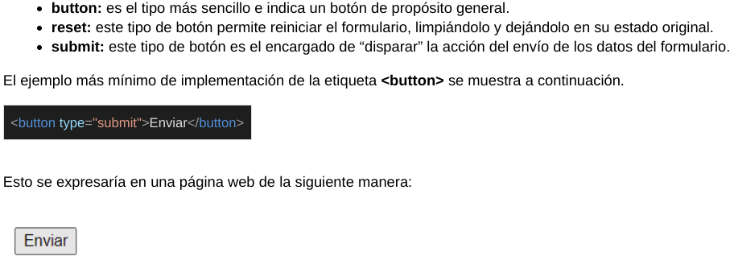
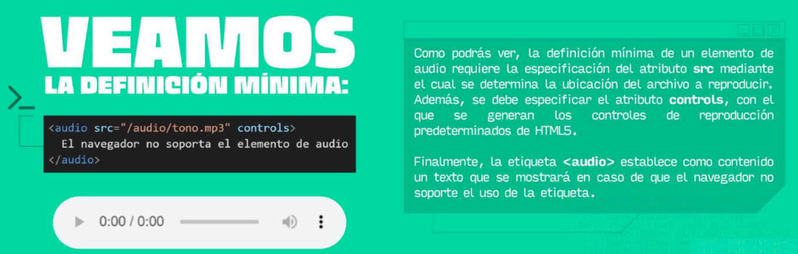
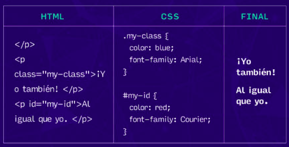
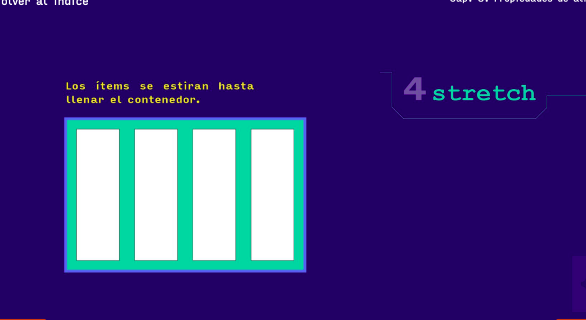
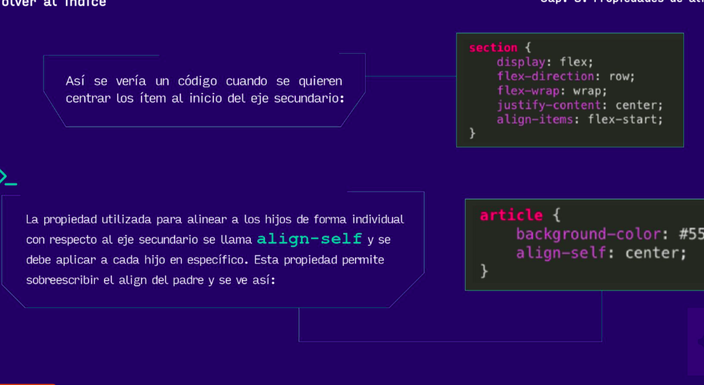
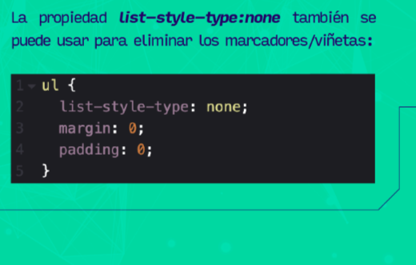
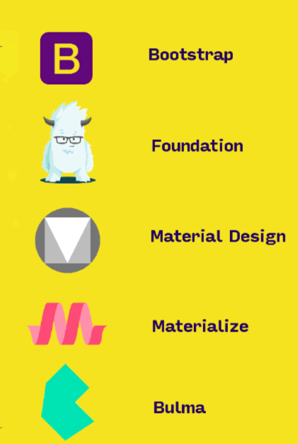

# Estructura de datos
https://javascript.info/array  
https://medium.com/techwomenc/estructuras-de-datos-a29062de5483
# Preguntas
* Estructuras contiguamente asignadas (arrays, matrices, heaps y hash tables)?
* Estructuras enlazadas(listas, árboles y gráfos)?
* Contenedores (stacks y queues)
* En que momento es conveniente usar cada estructura de datos? (array vs contenedores)

# Definición
Una estructura de datos es un conjunto de información agrupada. Existen estructuras de datos dinámicas y estáticas. La diferencia entre los 2 tipos es la capacidad que tienen para modificar su tamaño en medio de la ejecución del programa, las dinámicas pueden pero las estáticas no, además también hay estructuras **enlazadas y contiguas**

# Estructuras enlazadas
Este tipo de estructuras se caracteriza porque usa un mecanismo de "punteros" llamados nodos que apuntan al lugar donde está guardado el dato. Para trabajar con este tipo de estructuras hay que tener en cuenta que se debe guardar espacio para **el dato en sí a guardar y para la ubicación de la memoria del siguiente dato**. 

# Contenedores
Se caracterizan por la forma ordenada de recuperar los datos que depende de la forma en que se incertaron

## Stack(pila)
Este contenedor soporta la recuperación ordenada de datos LIFO(**Last Input - First Output** / Último en entrar - Primero en salir) lo que significa que el orden no importa 

## Queue (cola)
Soporta la recuperación ordenada de datos FIFO(**Firt Input - First Output** / Primero en entrar - Primero en salir) en este caso el orden si importa porque el dato que esté de primero es el que va a tener "toda la atención"

## Linked List (Listas enlazadas)
Conjunto de **nodos** ordenados que contienen los valores que necesitamos, cada uno tiene un valor y una referencia al siguiente nodo. Hay 2 tipos de linked list, las simples **singly linked list** y las dobles **doubly linked list**. 
Hay que tener claro los conceptos: 
* value: es el valor que guardamos
* head: referencia la primer nodo de la lista
* tail: referencia al último nodo de la lista
* next: referencia de un nodo al siguiente nodo
* prev: referencia al nodo anterior

### syngly linked list
Cada nodo guarda, **un valor** y **referencia la siguiente nodo**. Ejemplo: 
Las sygly se observan como un edificio, donde cada piso es un nodo y si quiero ir al piso 5 tengo que pasar por el 1, 2, 3 y 4 para llegar al destino. Esta es una representación: 

### doubly linked list
Cada nodo tiene, **referencia al nodo siguiente(next), referencia al nodo anterior (prev), valor del nodo, referencia al primer nodo (head), referencia la último nodo**

# HTML5
Es un lenguaje de etiquetas que permite definir la estructura de la página web, como los titulos, botones, párrafos, etc. HTML significa **Hypertext Markup Language - Lenguaje de Marcado de Hipertexto**. Para comentar se usa **\<!-- Comentario -->**

# Preguntas
* Como especificar la página de inicio sino se tiene un index?

## W3C 
World Wibe Consortium. Este estándar se crea con el fin de que todos los desarrolladores pueden entender el código que alguien más escribió. El sitio oficial es https://www.w3.org/ El estándar actual de HTML se encuentra en https://html.spec.whatwg.org/ 

## Nombrar archivos HTML
Se utiliza el método **kebab-case** que es todo en minúsculas y separar las palabras por guiones, es recomendable hacerlo en inglés 

# Etiquetas mínimas
## <!DOCTYPE>
Esta etiqueta le dice al nevegador que tipo de documento está por desplegar y le indica la versión de HTML que se uso para el desarrollo. Siempre debe ir en la parte superior

## <html\>
Es la etiqueta raíz dentro de la cual se deberan escribir las demás etiquetas. Se puede especificar el idioma principal con el atributo **lang**. Dentro de esta etiqueta también se debe declarar la **head** y **body**

## <head\>
Es la primera etiqueta que va después de la raíz (html). En esta etiqueta se van a definir elementos que no tienen efecto visual pero que son descriptivos para el navegador que tienen una relevancia, sin embargo, acá va la etiqueta **tittle** que si tienen un efecto visual

## <body\>
En esta etiqueta es donde van a estar ubicados la mayoria de elementos que el usuario va a poder ver

# Estructuración básica de textos
Además de tener en cuenta el uso de las etiquetas de párrafo (p) y de encabezados (h1-h6) hay que darle importancia a las etiquetas de negrita (b- bold), italica (i-cursiva) y underline (u-subrayado). Hay que mencionar que no se puede abusar de estas etiquetas ya que este formato es preferible darlo desde el **css**, en su lugar existen las etiquetas **strong** que se usa para señalar un texto importante en el documento y **em** que indica un fragmento de texto al cúal debe darse énfasis. 

# Estructuración básica de listas
## Listas desordenadas
Son las listas que tienen viñetas. Se usa la etiqueta **\<ul>** para definirlas y la etiqueta **\<li>** para agregar elementos

## Listas ordenadas

Las listas ordenadas tienen algunos atributos que pueden ser utiles: 

## Listas de definiciones
Se usa para relacionar términos y sus definiciones. Para abrir una lista de este tipo se usa **\<dl\>**, para indicar un término en la lista se usa **\<dt\>** y para especificar la definición se usa **\<dd\>**

# Hipervínculos

Para usarlos se necesita la etiqueta anchor **\<a>**, para saber a donde apunta la etiqueta se usan los atributos **href** se le indica el link y **target** se usa para indicar DONDE se abren si en una nueva pestaña, ventana, etc. 

## Anclas
Son enlaces que redireccionan a algún elemento en la misma página. Para poder usar esto el elemento debe tener un id

# Forms
Los formularios son usados para recopilar información de los usuarios **\<form>\</form>**
Los elementos que comunmente van dentro de un form son:
 
## Input
**\<input>**, sirve para darle la posibilidad al user de ingresar información. Puede tener varios tipos: 

## Select
Se usa para generar una lista desplegable **\<select>\</select>**, para agregar elementos a la lista se usa **\<option>\</option>**. Es importante tener en cuenta el atributo de value para el option ya que ese es el valor que se va a almacenar cuando el usuario selecciona, que es diferente al valor mostrado. 

## textarea
Es una caja de texto con mayor capacidad que un input normal. Se aplica **\<textarea>\</textarea>**

## fildset
Agrupa varios campos que están relacionados a un mismo conjunto de datos

## legend
Se usa para darle un titulo al conjunto de datos que se agruparon con fildset. El "titulo" de "Datos personales" es gracias a la etiqueta legend

## optgroup
Permite agrupar varias opciones de una lista desplegable

## Enviar datos de un formulario
### Button
Para enviar datos de un form lo primero que hay que hacer es crear un botón y definir su atributo **type** según lo que se quiere que haga el botón 

### method
Es la manera en como los datos se van a enviar. **get** muestra los datos en la URL. El inicio del envío de los datos va a aparecer con un ? y serán formateados como un par clave-valor separados por un ampersand (&). Estos signos se conocen como **query params**. Post manda los datos de forma que no sean visibles en la URL

### action
Es el atributo de form donde se especifica la página que procesa los datos que el formulario envió

# Metaetiquetas
Sirven para describir con mucha presición el contenido del sitio web. Para declarar los metedatos se hace en la etiqueta **head**

## Etiqueta link
Se usa para enlazar nuestra página con contenido extra de otra página. Debe tener 2 atributos como mínimo: **rel** establece el contenido entre mi página y la página a enlazar y el atributo **href** para especificar la ubicación del contenido a enlazar

Esta etiqueta se usa normalmente para usar css: 

## Meta
Con esta etiqueta se definen varias caracteristicas como:

de esta manera se establece el conjunto de caracteres que el documento va a usar

Con esta etiqueta nos aseguramos de que el contenido de la página se ajuste a la pantalla del dispositivo

## SEO (Search Engine Optimitazion)
Esta técnica consiste en agregar distintas metaetiquetas con el fin de que los motores de búsqueda puedan mostrar nuestra página en los primeros resultados. 

## Modificadores de headers

## Especificar datos para robots
### Crawlers o indexador o rastreador
Es un programa informático que se encarga de hacer una copia de todos los enlaces que hay en las páginas web y crear una copia en su base de datos para interconectar millones de páginas web

### robots.txt
Estos archivos le dicen al crawler que contenido es innecesario de la página para tener en cuenta al momento de indexar

Con esta etiqueta también le decimos al robot que información indexar y cúal no. no archive le dice al motor de búsqueda que no guarde la página en el archivo y **nosnipped** le dice al motor de búsqueda que no liste la página en los motores de búsqueda

# Etiquetas de recursos
## etiqueta img
Se usa para mostrar imágenes en la página. Necesita de los atributos **src** que especifica la dirección donde está alojada la imágen, puede ser en el directorio de la página y **alt** que sirve para especificar un texto alternativo que va a describir el contenido de la imágen en caso de que el recurso no se pueda cargar o para usuario que necesiten ayuda visual. **\**

## Etiqueta de audio
**\<audio controls>\</audio>** el atributo de controls debe ir para que aparezca el reproductor. 

Es posible especificar diversas fuentes de reproducción de audio para que el navegador tome la elección que más convenga

## MIME TYPE
Es una forma estandarizada de indicar la naturaleza de un archivo, documento o conjunto de datos
https://developer.mozilla.org/es/docs/Web/HTTP/Basics_of_HTTP/MIME_types

https://www.iana.org/assignments/media-types/media-types.xhtml#audio

## Etiqueta de video 

**\<vide>\</video>**

## Etiqueta de iframe
Sirve para incrustar contenidos a mi sitio web, como videos desde youtube con el fin de hacer más ligero mi sitio. Por ejemplo para insertar videos de youtube: 

# Semántica en HTML

Es la forma correcta de escribir los elementos con código. Una etiqueta es semántica cuando indica el contenido que tiene. Por ejemplo la etiqueta **\<section>** se usa para indicar que hay un capítulo o sección dentro de la página. Hacer buen uso de las etiquetas semánticas permiten una mejor indexación de los buscadores 

html5doctor.com

Todos los elementos de html5: https://html5doctor.com/element-index/

Hoja de trampa: https://learntheweb.courses/topics/html-semantics-cheat-sheet/

## span y div
 Estas etiquetas solo se deben usar cuando el contenido que se quiere representar no pueda ser incluido en las etiquetas semánticas existentes. **profundizar en su uso**

 ## header
 Se usa para marcar un grupo de elementos de introducción (titulo, logo, info de contacto y otros elementos introductorios que identifican el sitio web) o de navegación dentro de una sección o documento. Puede contener el índice de una sección, formulario de búsqueda y logos relevantes. Se puede usar 1 etiqueta header por cada sección del documento
 

 ## hgroup
 Agrupa un conjunto de uno o más encabezados, h1-h6. Su uso más común es ajuntar el título de la página con su eslogan. **Se eliminón en el estándar de HTML5 en 2018, se debe evitar su uso**

 ## nav
 Se usa para marcar una sección cuya función sea la navegación por la página web. 
 

 ## main
 Sirve como contenedor de la parte más importante de un documento. No debe haber más de una etiqueta main en un documento y esta debe ser descendiente de una de las siguientes etiquetas: html, body, div o form. 

 ## article
 Se usa para marcar un contenido independiente que tendría sentido en otro contexto diferente al tratado en el documento y que podría usar información que viene de otros sitios. Se usa para marcar información que viene de otro sitio
 

 ## section
 Se usa para marcar una sección genérica de una app o documento, es una agrupación temática del contenido
 

 ## aside
 Marca un trozo de contenido que está relacionado con el contendio de la página pero que no hace parte del mismo 

 ## footer
 Se usa para marcar el pie de una sección o de un documento

 # CSS
 Cascading Style Sheets - Hojas de estilo en cascada 

 # Selectores
 Es la parte del código css que indica a que elemento html se le va a aplicar el estilo
 

## Selector de elemento \<tag>
Es el elemento html explícito al que se le va a aplicar el estilo 

## Selector de clase (.)
Cualquier elemento html que en el atributo **class** tenga el nombre de la clase que se le va a aplicar el estilo, será modificado

## Selector id (#)
El estilo se aplicará a cualquier elemento html que en el atributo **id** coincida con el estilo. Solo se ve utilizar esta propiedad si en el documento hay algún estilo muy particular que se debe aplicar a un elemento

## pseudoclase (:)
Las pseudoclases dependen del elemento porque **todos no tienen los mismos**. Afectan al estado de un elemento según lo que se haga. Por ejemplo cambiar el color de un botón cuando el mouse esté sobre él 

## pseudoelementos (::)
Modifican el aspecto interno de la etiqueta. 

## Selector agrupados
El estilo se le aplica a la clase h1 y special   

## Selector de atributo 
El estilo se aplica si un atributo está presente en el elemento o si el atributo tiene un valor específico   

## Combinadores
El estilo se le aplica a los parrafos hijos directos de article

El siguiente estilo solo se le aplica al parrafo que hay después de un h1

Acá se seleccionan todos los elementos p que están después de un h1, sin importar que halla otros elementos entre un h1 y p

**Hay muchos selectores** 
https://www.w3schools.com/cssref/css_selectors.php

# Implementación de css
## inline
Son los estilos que se pueden aplicar a una etiqueta con el atributo **style**. **Es recomendable no usar este método para aplicar estilos ya que ensucia la estructura html**

## internal css
Son estilos dentro del documento html pero dentro de las etiquetas **\**. Tampoco es recomendable usar este método para aplicar estilos

## external css
Es la manera más recomendada para aplicar estilos, se basa en un documentos .css que se encarga de gestionar todos los estilos del documento de html. Se enlazan con la etiqueta en el head \<link rel="stylesheet" href="">

# Especificidad
Marca la importancia que tiene un estilo a la hora de aplciarse a un elemento dependiendo del lugar donde fue definido y el selector usado. La jerarquía de los selectores es la siguiente: 

Para calcular la especificidad hay que tener en cuenta

Calculadora de especificidad https://www.codecaptain.io/tools/css-specificity-calculator

# Modelo de caja o box model
Es la forma en la que estan delimitados los elementos html. Hay 2 tipos de elementos: 
## Elementos en línea 
Son todos aquellos que conviven uno junto al otro sin generar saltos de línea como img, strong, span

## Elementos de bloque 
Representan elementos que implican un bloque lógico aislado, debe llevar un espacio antes y después de su aparición como las etiquetas div, p, article y section. 

## Display
Con la propiedad **display** de css es posible modificar el comportamiento de estos elementos
. 
* inline
* block
* flex, permite maquetar de una manera más fácil las páginas. Hay un contenedor llamado **flexbox** que contiene la propiedad **display: flex**, desde ese contenedor se podrá: 

Esto permite diseños flexibles, alineación de elementos y reordenar contenido sin tocar el código HTML

## Elementos básicos de flexbox

* item: son los cuadros verdes, lo que está dentro del contenedor
* eje principal (barra morada) es la orientación de lso items

Para manipular la dirección y comportamiento de los items del flexbox se usan las propiedades **flex-direction y flex-wrap**, flex wrap permite que los items no se salgan o sí dependiendo del valor. 

Así se ve un contenedor con **flex-wrap: wrap**, el contenedor crece para permitir que los items quepan, en cambio con **flex-wrap: nowrap** los elementos se ponen más pequeños: 

La propiedad de **justify-content** permite acomodar los items dentro del contenedor con respecto al eje principal

**align-items** permite acomodar los items con respecto al eje secundario

Las propiedades anteriores son propiedades que se aplican al **contenedor** excepto **align-self** que se aplica a los items, las siguientes propiedades se aplican a los items. Así se vería align-self: 

El contenedor tiene definido **align-items: flex-end** (osea que los elementos están ordenados en posición horizontal así que el eje secudnario es el vertical) pero los elementos 1 y 4 tienen la propiedad **align-self: flex-start** acomoda los elementos respecto al eje secundario lo que provoca ese cambio 

Profundizar como funciona esta propiedad

# Tipografía 

Google tiene un repertorio de fuentes en su producto gratuito **Google fonts**. Para asegurarse de que la tipografía se cargue exitosamente, se tienen 2 opciones: 
## Descargar localmente la fuente

 
## CDN

Este ejemplo es de Google font

## Tamaño 
Los tamaños de la tipografía se puede especificar con: 

## Medidas absolutas
Representan un tamaño específico

## Medida relativa

## Medida específica

Solamente con la propiedad **font-size** se puede específicar de diferentes formas el tamaño

## Estilo de la tipografía

# Peso de la tipografía 
Se refiere al grosor de la letra
## Valores abosolutos

## Valores relativos

## Númericos

El grosor se define en el atributo **font-weight**

# Backgroun image
object fit le dice a la imágen como redimensionarse en su contenedor para caber. Puede ser containe, cover, fill, none, scale-down
* Fill, este es el valor por defecto de la propiedad **object fit**. La imágen cambia de tamaño para llenar la dimensión dada, de ser necesario la imágen se aplasta o se estira para que quepa en el contenedor
* contain, la imágen mantiene su relación de aspecto pero se cambia de tamaño para ajustarse a la dimensión dada
* cover, la imágen mantiene su relación de aspecto y llena la dimensión dada. La imágen se cortara para ajustarse
* none, la imágen no cambia de tamaño
* scale down, la imágen se reduce a la versión más pequeña de none o containe

Para especificar las dimensiones de una imágen se usan los atributos width y height que es ancho y alto

# Inherit
Es un valor permitido en todas las propiedades de css. Hce que el elemento al cual se le aplica tome el valor calculado de la propiedad de su elemento padre

# Decorar una lista

# Maquetación 
Es la etapa en la que se estrucutra, se ordena y distribuyen los elementos del sitio web como menús, imágenes, botones, videos, enlaces, titulos, etc. 

# Grid  
css grid layout permite hacer las páginas más flexibles dependiendo del tamaño de la pantalla. Se puede organizar el contenido en filas y columnas. Para usar un diseño grid, hay que definir el display del contenedor como **grid**. 
**grid-template-rows:** define cuantas filas va a tener la tabla, **grid-template-columns:** define cuantas columnas tendrá la tabla, **grid-template-areas** define el nombre de cada cuadriculo. Por ejemplo: 

Este es el result

O también puede ser: 

# Responsive

Técnica de diseño web. NO importa desde que dispositivo se acceda a la página, siempre se va a mostrar el contenido de manera correcta

# Media queries
Con esta técnica se pueden definir estilos completamente diferentes dependiendo del tamaño del dispositivo

 Por ejemplo: 
 Si la pantalla tiene un ancho mínimo de 900px:
 
así se ve:

Y si la pantalla tiene un ancho máximo de 700px: 

# Librerias CSS

# Angular

