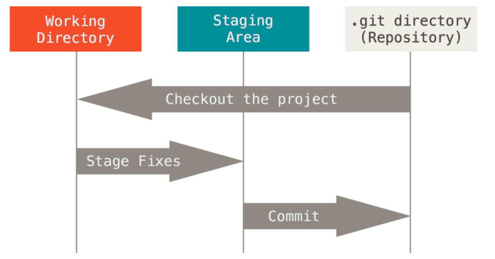
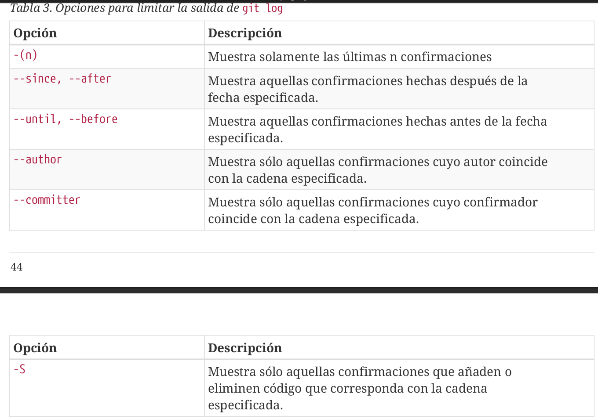
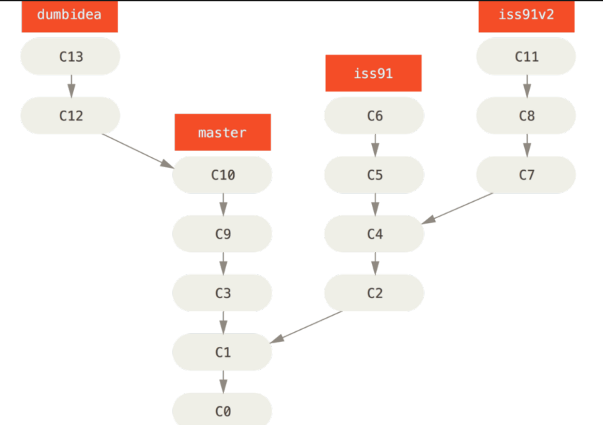
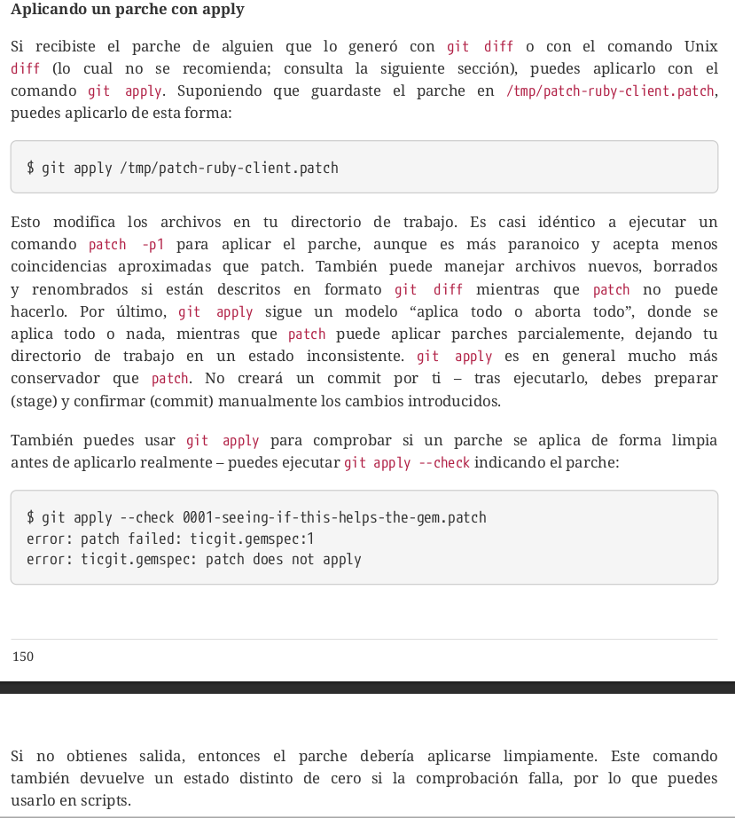
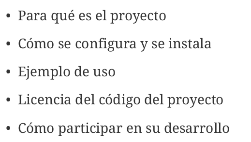
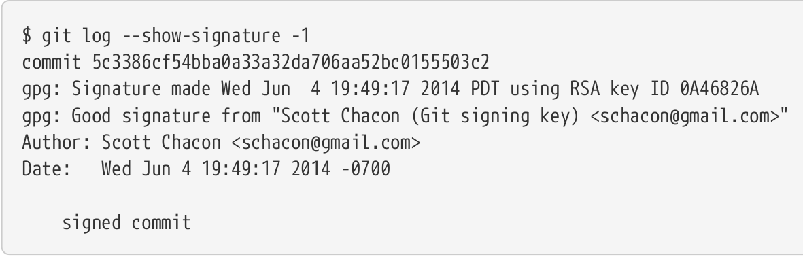

# Tener en cuenta
## Las Etiquetas (tags)
Son referencias que apuntan a referencias concretas en el historial de Git
### Etiquetas ligeras
Son nombres que hacen referencia a un punto en concreto en el historial de Git, sin tener mucha más información. Se pueden utilizar de manera privada
### Etiquetas anotadas
Estas etiquetas contienen metadatos que dan información como **nombre de la persona que etiqueta, correo electrónico y la fecha** esto es importante para una publicación
### Como crear una etiqueta
**git tag \<tagname>** esto crea una etiqueta ligera. **git tag -a \<tagname> -m message** crea una etiqueta anotada y un mensaje asociado  
### Para ver las etiquetas en un repo
**git tag**

# Inicio sobre el control de versiones 
Un controlador de versiones se desarrolló con el fin de hacer que perdure de manera eficiente y sencilla las versiones e histórico de un archivo/proyecto. Guardando el quien, cuando, como, que y donde en una base de datos para posteriormente permitir verificar errores o reucperar cosas. 


## VCS Centralizados

La ventaja de este sistema de control de versiones frente a uno local es que permite la colaboración de varias personas. Uno de los incovenientes es que si se cae el servidor, nadie va a poder seguir trabajando en con el VCS

## VCS Distribuidos

La ventaja de este sistema es que cada cliente va a tener una copia exacta y completa del repositorio. 

## Forma en que Git maneja los cambios

Al momento de guardar un cambio, Git literalmente toma una instantánea y crea una referencia para acceder a ese cambio. Si el archivo no se modificó, se guarda la versión más reciente

## Git tiene integridad
Significa que todo en Git es verificado por una suma de comprobación (checksum) antes de ser almacenado eso significa que todo lo que se haga en Git va a ser conocido por el sistema. Esta checksum es generada por el método **hash SHA-1**. En Git es muy difícil que la información se pierda 

## Los 3 estados
### Confimado
Significa que los cambios están guardados de manera segura en la base de datos local
### Modificado
Significa que has modificado el archivo pero todavía no lo has confirmado a la db
### Preparado
Significa que un archivo modificado se marcó en su versión actual para que vaya en la próxima versión


### Directorio de Git
El directorio de Git es donde se almacenan los metadatos y la base de datos de objetos para tu proyecto. Es la parte más importante de Git, y es lo que se copia cuando clonas un repositorio desde otra computadora.

### Directorio de trabajo
El directorio de trabajo es una copia de una versión del proyecto. Estos archivos se sacan de la base de datos comprimida en el directorio de Git, y se colocan en disco para que los puedas usar o modificar.

### Área de preparación 
El área de preparación es un archivo, generalmente contenido en tu directorio de Git, que almacena información acerca de lo que va a ir en tu próxima confirmación. A veces se le denomina índice (“index”), pero se está convirtiendo en estándar el referirse a ella como el área de preparación.


## Configurando Git por primera vez 


Para comprobar las configuraciones que Git hizo se puede usar **git config --list**

## Servidor de IRC
Para obtener ayuda se puede usar los canales #git o #github del servidor IRC Freenode **irc.freenode.net**

# Fundamentos de Git
## Inicializando un repositorio en un directorio existente
Para iniciar un repositorio se usa el comando: **git init**. Esto crea un subdirectorio llamado **.git**

## Clonando un repositorio existente
**git clone url** de esta manera se clona todo la historia del proyecto remoto de manera local. Si se quiere clonar un repo con un nombre diferente puede hacerse **git clone url newname**


## Ciclo de vida del estado de los archivos


## Revisando el estado de los archivos
Con el comando **git status** se ve el estado del archivo

## Rastrear archivos nuevos 
**git add filename**. Rastrear un archivo (tracked) significa que se le van a sacar instantáneas (se van a guardar en la db). 

## Preparar archivos modificados
Git prepara archivos (staged) de acuerdo al estado en el que estaba cuando se ejecuta **git add**. Entonces un archivo puede estar en el stage y fuera del stage


## Salida abreviada


## Ignorar archivos

### Reglas de patrones que se pueden incluir en el .gitignore


## Ver los cambios preparados y no preparados
**git diff** muestra que cambió pero aún no está preparado, si los cambios están preparados git diff no va a mostrar nada. Si se quiere ver lo que se a preparado y será incluido en la próxima confirmación se puede usar **git diff --staged** este comando compara los cambios preparados con la última instantánea confirmada


## Confirmar cambios
**git commit -v** De está forma aparace en el editor lo que has modificado y va a ser confirmado. Para escribir el mensaje de confirmación directamente en el comando sin abrir el editor de texto se puede usar **git commit -m**. Para saltarse la parte del añadido se puede usar el argumento -a en el comando commit **git commit -a -m** y se van a añadir automáticamente los archivos que están rastreados. 

## Eliminar archivos
**git rm**. Este comando borra los archivos del stage y del directorio de trabajo, si solo se borrará el archivo del área de trabajo aparecería "cambios sin preparación para confirmar" en la salida de git status

Si preparo un archivo y lo quiere eliminar se puede usar **git rm --cached fileName** (también se puede especificar patrones glob)

## Cambiar el nombre de archivos
**git mv namefila newname**

## Ver el historial de confirmaciones 
**git log**. Con el argumento **-p** se muestran las diferencias en cada confirmación. **git log --stat** tras cada confirmación muestra cuantos archivos han sido modificados y cuantas líneas se han agregado y eliminado, al final de todos los commits muestra un resumen de esa información. 
Con pretty se puede especificar el formato de salida de los logs, se le pueden pasar las opciones **oneline, short, full, fuller** . Además también se puede especificar el formato propio

### Opciones útiles para pretty

graph

### Opciones más comunes de git log

### Limitar la salida del historial
Se puede usar **git -log -n**, donde n es un número cualquiera para mostrar los n últimos commits. **git log --since=2.weeks** de esta manera se pueden ver los commits hechos durante las 2 últimas semanas, Este comando acepta muchos formatos. Puedes indicar una fecha concreta ("2008-01-15"),o relativa, como "2 years 1 day 3 minutes ago" ("hace 2 años, 1 día y 3 minutos").




## Deshacer cosas
### Deshacer commits

### Deshacer un archivo preparado 
Para sacar un archivo del staging se usa **git reset HEAD nameFile**
### Deshacer un archivo modificado 
Con **git checkout <"file">** de esta forma vuelve al estado en le que estaba el archivo en la última confirmación 

## Repositorio remotos
Para añadir repositorios remotos se debe hacer **git remote add \[nombre] \[url]**. Si se quiere traer toda la información de un repo al repositorio personal se utiliza **git fetch \[nombre_repo]**

Este comando no combina automáticamente con mi trabajo ni modifica el trabajo que ya se tenía, la combianción se hace manualmente. Con **git pull** trae la información del remoto y los combina automáticamente con lo que ya se tenía en la rama 

### Enviar a los repositorios remotos 
**git push \[nombre-remoto] \[nombre-rama]**


### Eliminar y renombrar remotos
**git remote rename newName**

Para eliminar un remoto se usa **git remote rm name**


## Etiquetado
Son puntos especificos en el historial marcados como importantes. Para listar las etiquetas se usa **git tag** Hay 2 tipos de etiquetas, las ligeras y las anotadas


### Etiquetas ligeras
es muy parecido a una rama que no cambia - simplemente es un puntero a un commit específico.

### Etiquetas anotadas
Sin embargo, las etiquetas anotadas se guardan en la base de datos de Git como objetos enteros. Tienen un checksum; contienen el nombre del etiquetador, correo
electrónico y fecha; tienen un mensaje asociado; y pueden ser firmadas y verificadas con GNU Privacy Guard (GPG). Normalmente se recomienda que crees etiquetas anotadas, de manera que tengas toda esta información; pero si quieres una etiqueta temporal o por alguna razón no estás interesado en esa información, entonces puedes usar las etiquetas ligeras.


### Etiqueta ligera


### Etiquetado tardío
Para crear una etiqueta de un commit que sucedio hace tiempo o no fue reciente, también se puede etiquetar especificando su checksum


### Compartir etiquetas
Por defecto cuando se realiza un git push al servidor, no se envian las etiquetas, para enviarlas hay que ejecutar **git push origin \[etiqueta]** o si se quieren enviar todas entonces **git push origin --tags**

### Sacar una etiqueta


## Alias de Git 

Si se queire ejecutar un comando externo de git, el comando debe iniciar con !, así: 


# Ramificaciones en Git

Para crear una rama nueva se usa **git branch nameBranch**. El apuntador HEAD es especial ya que apunta a la rama local en la que estes en ese momento

Con ese comando se puede ver a donde apunta cada rama

## Cambiar de ramas
**git checkout branchName** de esta manera el apuntador HEAD cambia a la rama donde hayas cambiado 

Cuando se realiza un cambio en la rama nueva, sucede esto:


Al volver a la rama master, se ve así: 


El flujo de trabajo realizado en diferentes ramas se puede ver de una forma gráfica así: 

 Para saltar entre ramas hay que tener un directorio de trabajo limpio, no tener nada en el staging ni y todos los commits hechos.
 Para hacer una fusión se usa **git merge branch**. Para borrar una rama que no se necesita más se hace **git branch -d branch**
 

## Fusion Fast forward


## Fusion Recursive


## Tipos de merge para consultar
* Fast-forward
* Recursive

## Principales problemas al hacer fusiones


Con **git mergetool** se pueden usar herramientas gráficas para resolver los conflictos en una fusión


Después de arreglar los conflictos, para terminar el merge hay que hacer un commit. 

## Gestión de ramas


## Flujos de trabajo ramificados
### Ramas de largo recorrido
La idea de esta forma de trabajo es tener una rama **main** donde se guarda el código estable y tener otras ramas donde se desarrollan pruebas y otro tipo de trabajo para cuando esté listo, poder fusionarla con la rama main. 


### Ramas puntuales




### Ramas remotas


## Seguimiento a las ramas 
Existen las ramas de seguimiento que son las ramas que tienen que ver con alguna rama del repositorio remoto. Cuando se clona un repositorio, automáticamente se suele crear la rama **master** que hace seguimiento de **origin/master** (remoto origin - rama master)


Con **git branch -vv** se puede ver información detallada de cada rama


## Eliminar ramas remotas
**git push nameServidor --delete nameBranch**


## Reorganizando el trabajo realizado
 Además de poder fusionar el trabajo usando merge, hay otra manera de fusionar las ramas. La forma como merge hace su trabajo es a 3 bandas, osea, entre las 2 últimas instantáneas de cada rama y el ancestro común a ambas creando una nueva instantánea y la correspodiente confirmación. La forma como la reorganización funciona, hacer un **rabase** es capturar los cambios de una rama y aplicarlos encima de otra
 
 

 **NO QUEDÓ CLARO EL TÉRMINO!!!!!!!!!!!!!!!!!!!!!!!!!!**

 **PARA EVITAR PROBLEMAS, NO REORGANIZAR NADA QUE YA HAYA SIDO COMPARTIDO**

# Git en el servidor


* GitLab
* GitWeb

# Git en entornos de trabajo distribuidos
## Flujo de trabajo centralizado 
El repositorio central admite cambios siempre y cuando la persona esté al día con el server. Si 2 programadores se traen la info del server al local y el primero hace cambios y los sube, el segundo hace cambios no los va a poder subir porque tiene que estar al día con el server, osea que primero se tiene que traer los cambios que hice el primer programador para luego poder subir los propios


## Flujo de trabajo Administrador-integración

Esta formas de trabajar es muy común en hubs como GitLab o GitHub, permitiendo que cada contribuidor trabaje a su ritmo y que el administrador vaya implementando los cambios cuando sea necesario

## Flujo de trabajo Dictador-Tenientes


## Contribuyendo a un proyecto
 La forma de contribuir a un proyecto depende de muchos aspectos y es dificil describir solo un métedo de contribuir ya que existen muchas formas de hacerlo. 
 Las variables que intervienen son: 
* Conteo contribuyentes activos
* Flujo de trabajo para el proyecto
* Acceso de confirmación

### Pequeño equipo privado (página 129)
Hay que tener en cuenta que cada vez que se vaya a empezar a trabajar sobre los propios cambios hay que empezar con traerse todo lo que esté en el server y hacer lo mismo cada vez que se vaya a mandar (push) al server, asegurarse de que el trabajo esté al día. El flujo de trabajo se vería así: 
 

### Equipo privado administrado
Esta forma de contribuir se basa en que cada equipo trabaja en su rama particular y después el encargado de fusionar esas ramas a la maestra hace su trabajo

De esta manera se hace commit a una rama del servidor pero que se llama distinta en local. La rama local **featureB** hace hace referencia/rastrea a la rama remota **featureBee**
El flujo de trabajo se ve así: 


### Proyecto público bifurcado
Un **fork** es la copia de un repositorio completo en la cuenta de otro usuario

### Proyecto público a través de correo electrónico (pag 146)

## Manteniendo un proyecto
### Trabajando con ramas puntuales
ES buena idea probar los nuevos cambios que alguien quiera aportar al proyecto en una rama de prueba (rama puntual) antes de fusionarlos a la rama oficial, por la facilidad de tomar decisiones de desecharlo, posponerlo, etc...

### Aplicando parches recibidos por e-mail
Hay 2 formas de hacerlo, con apply y con am.
#### Con apply


#### Con am
Es recomendable aplicar parches con **git am** si el parche se creó con format-patch. 


### Recuperando ramas remotas
Esta forma de mantener un proyecto se basa en que se esté colaborando con otra persona pero ella tiene su propio repositorio, lo que se puede hacer es que tú te graigas una rama de su repositorio a tu local y ver los cambios


### Decidiendo que introducir
Una vez se tengan todos los cambios en una rama puntual, se pueden ver las diferencias que hay entre la master y la puntual, así: 

Lo que hace es que se toma el primer commit del ancestro en común y el último de la rama puntual para ver las diferencias

### Integrando el trabajo de los colaboradores
La forma más básica de hacer esto es fusionar las ramas a la rama master: 


Pero si se tiene un proyecto más grande y de más envergadura es preferible hacer **un ciclo de integración de 2 fases**. La idea es tener 2 ramas principales, de forma que primero se integren los cambios en una rama y luego en la principal


## Flujos de trabajo reorganizando o entresacando
**profundizar en el rebase y un entresacado

## rerere
reuse recorded resolution (reutilizar resolución grabada). Es un mecanismo que se utiliza para solucionar problemas de integración más fácil, si hay un error al fusionar algo y previamente ya se había solucionado ese error, entonces rerere va a intentar arreglar el error basado en la solución que ya se había hecho. 


## Preparando una versión 


# GitHub
## Llaves SSH
Se debe especificar el archivo id_rsa.pub

## Bifurcación de proyectos (fork)
Hacer un fork de un repositorio significa hacer una copia en mi cuenta lo que me convierte en el dueño. Esto es útil cuando solo tenemos permisos de lectura en el proyecto

## Flujo de trabajo de github


### Repositorio remotos
Si se va a añadir el repositorio remoto en vez de clonarlo hay que añadirlo y depués hacer el pull: 
* **git remote add origin \<link>**
* Hacer **git pull origin rama_remota**

## Creación de un pull request
Hacer un pull request es hacer una petición al administrador del proyecto para que implemente mis cambios. Una situación como ejemplo: 
Se quiere contribuir en un proyecto agregando un cambio

Luego de hacer el **fork** se prosigue con los siguientes pasos:


Ahora, si volvemos al repositorio (al fork) GitHub va a mostrar un aviso para que hagamos un pull request


## Pull request avanzados

GitHub nos puede avisar si un pull request se puede fusionar limpiamente o si hay errores. 


Si surgen problemas con el pull request, una solución puede ser esta


De esta manera el pull request se autocheckea y avisa si es posible o no el fusionado automático


## Referencias  
En un proyecto un pull request y un issues (incidencia) tienen un número identificador único, para referirse a ellos se puede hacer: 
* \# númeroPull(por ejemplo el issues 3, #3)
* usuario#número
* usuario/repo#num

Acá se hace referencia a distintos request: 

Al enviarlo se ve así: 


Una vez se cierra el pull request al que se está haciendo referencia, es fácil identificar el pull request que hizo que este se cerrara


También se pueden hacer referencias a commits usando el SHA-1

## Markdown
Es escribir en texto plano pero que luego se convierte en texto con formato. 

GitHub añade varias funcionalidades extras a la sintáxis básica del markdown:
### Listas de tareas


### Fragmentos de código

Se puede especificar el lenguaje después de los símbolos ```para intentar hacer el resaltado de la sintáxis

### Citas
Si se quiere responder solo a una parte de un comentario grande que le hicieron, puede citar esa parte así: 


### Emojis
se puede escribir el nombre de un emoji predecido por 2 puntos(:) y GitHub va a dar sugerencias sobre el que se busca

el nombre de un emoji va entre :nombre:


### Imágenes
Se puede arrastrar y soltar imágenes desde los archivos locales


## Mantenimiento de un proyecto
### Gestión de los pull request
Si alguien pide un pull request, al dueño del proyecto le llegará al correo una notificación con un aspecto similar al siguiente: 

### Archivos especiales
El archivo **README**, este archivo puede estar en formatos **README, README.md, README.asciidoc y otros más**, cuanto GitHub detecta este archivo lo muestra en la página principal con su debido rendirazado según su formato. Este archivo normalmente se utiliza para dar información acerca del proyecto
.

El otro archivo es **CONTRIBUTING**. Cuando se intente hacer un pull request y GitHub identifique este archivo, se va a hacer la apertura de ese archivo. Donde se indican normas para hacer un pull request

## Screepting en GitHub
### Enganches (Hooks)
Las secciones Hooks y Services, de la página de administración del repositorio en Github, es la forma más simple de hacer que GitHub interactúe con sistemas externos.

Para ir a los servicios y hooks disponibles hay que ir a la sección **settings** del repositorio y buscar **web hooks**


Se puede crear un web hook con un código como este: 


## La api de GitHub
Se verá el solo el uso básico. Lo más básico que podemos hacer es una petición GET a una llamada que no necesite autentificación. Por ejemplo, información de solo lectura de un proyecto de código
abierto. Por ejemplo, si queremos conocer información acerca del usuario “schacon”, podemos ejecutar algo como:


Solamente se necesita ejecutar la primer línea para conocer el resto de información. Así se ve cuando yo lo ejecuté: 


# Herramientas de Git
## Revision por selección
Hay varias maneras de seleccionar un commit especifico o un rango.
### SHA-1 corto
Git puede identificar un commit sin la necesidad de pasarle el hash completo, con los primeros 4 dígitos es suficiente, siempre y cuando no existan amibgüedades, es decir, que los dígitos usados sean únicos de ese commit. Se puede usar **git log --abrev-commit** para mostrar el hash corto.

### Referencias por rama
Si una rama está apuntando al commit que necesito puedo usar esto: 

Los 2 comandos son equivalentes
### Referencias por ancestros
Por ejemplo se pueden ver los commits previos de HEAD usando:
 O usando: 

### Rangos de commits
Esto se usa para ver **los commits que son alcanzables por una rama peor no por otra** (los cambios que están sin fusionar)


### Múltiples puntos

### 3 puntos
Si se quiere ver los commits que no están en ambas ramas se puede usar: 


## Guardado rápido y limpieza
si no se quiere hacer un commit de un trabajo a medias pero se quiere cambiar de rama. Ejemplo:
Se empezó a trabajar en el proyecto y el estado del repositorio es este: 

En este punto no se quiere hacer commit aún, entonces se puede usar **git stash**

Ahora el resultado de git status va a ser: 

Para ver los guardados que se han hecho se puede usar: 


Para acceder a los guardados que se han hecho se usa **git stash apply stash@{num}** num hace referencia al guardado que se ve en la lista con stash list. Si no se especifica un guardado, se va a aplicar el guardado más reciente. 


### Creando una rama apartir de un guardado
Si se tienen un guardado rápido y se quieren probar los cambios antes de hacer commit, se puede crear una rama con lo que guardaste: 


## Firmando el trabajo

### Introducción a GPG

## Firmando tags

## Verificando Tags

## Firmando commits

## Verificando firmas en los commits

También se pueden configurar los merge y los git pull para que solo acepten commits que estén firmados


## Git grep
Se usa para buscar coincidencias en el código fuente. Por defecto va a buscar en todos los archivos con commit en el directorio de trabajo. Se puede pasar el argumento -n para mostrar el número de línea donde hay coincidencia. Las busquedas también admiten expresiones regulares


## Busqueda del registro de Git


## Búsqueda de registro de línea

Si git no puede encontrar la relación de la función con el lenguaje de programación, también se puede usar expresiones regulares 


## Reescribiendo la historia
### Cambiando la última confirmación

### Unir confirmaciones

### Dividiendo una confirmación
### Remover un archivo de cada confirmación


## Los 3 árboles

El **HEAD** se puedo entender más facilmente como la instantánea del último commit. El **índice** se entinede como el área de preparación. El flujo de trabajo de Git es entonces: 
1. Caundo se crea el repositorio, el HEAD no va a apuntar a ningún lugar porque todavía no hay commits
2. Cuando se hace **git add** lo que se hace es que el índice (staging) copia lo que halla en el directorio de trabajo
3. Cuando se hace el commit, HEAD entonces apunta a ese commit


## El papel del reinicio (reset)
Lo que **reset** hace es que
1. **Mueve el HEAD**. Mueve a lo que HEAD apunta, no es lo mismo que cambiar a HEAD en si mismo (como lo hace checkout)


2. **Acutualizando el índice (--mixed)**. El índice va a camibar con la información a la que esté apuntando el HEAD.
 
3. **Actualizar el directorio de trabajo (--hard)**. Es muy peligroso usar este método ya que de esta manera los datos perdidos se vuelven irrecuperables


