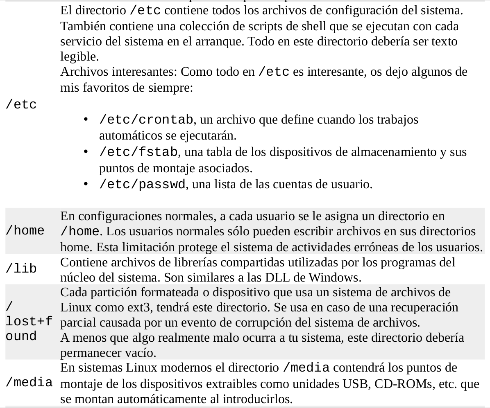

## Que es el shell?

Shell es la forma de referirce a un progrma generico que interpreta comandos. 

## Que es Bash?
bash es un programa de shell que interpreta comandos.

## Que es un comando ?

## Redireccionamiento I/O
* Normalmente la salida de un programa en la consola es de 2 tipos: Los resultados del programa (que se mandan a un archivo especial llamado standard output/stdout) y los errores y estados que se produscan (que se van a un archivo especial llamado standard error/stderr). Por defecto tanto la salida estándar como el error estándar no se guardan en el disco duro sino que están enlazados en la pantalla. La entrada de una aplicación se llama standard input/stdin que por defecto está **asociada al teclado**
* Para redireccionar la salida estándar de un comando a un archivo, se utiliza el operador **>**. Así: **ls -l /usr/bin > ls-output.txt**. Los resultados del comando ls se han mandado al archivo de texto. 
* Si la salida estándar de un comando da error y este se está redireccionando a un archivo y está bien desarrollado el comando, el archivo quedará vacío porque los errores no están configurados para la salida estándar sino para el **error estándar**. 
* Un truco para crear un archivo truncado o vacío a partir del redireccionamiento se puede usar: **> archivo.txt**
* El operador **>>** añade la salida de un comando a un archivo (sino existe lo crea) y no lo sobreescribe desde el principio como hace **>**. **ls -l /usr/bin >> ls-output.txt** sino que siempre va a añadir más contenido en ves de sobreescribir algo

## Redirigiendo el error estándar
* El shell no entiende entrada, salida y error estándar sino que utiliza **descriptor de archivos (file descriptor)**, el shell se refiere a esas cadenas con los descriptores 0, 1 y 2. Ejemplo: **ls -l /bin/usr 2> ls-error.txt** esa instrucción va a dar un error porque ese directorio no existe, entonces el error se va a guardar en el archivo ls-error.txt. 

## Eliminar salidas innecesarias
Cuando no se quiera ver la salida ni el error de un comando, se puede hacer: ls -l /bin/usr 2> /dev/null. El archivo null es un archivo especial que acepta entradas y no hace nada con ellas

## Redirigir la salida estándar y el error estándar al mismo tiempo
Existen 2 formas para hacer eso, una antigua y otra más moderna y eficiente: 
1. ls -l /bin/usr > ls-output.txt 2>&1. Primero redirigimos la salida estándar al archivo ls-output.txt y después redirigimos el descriptor de archivo 2 (error estándar) al descriptor de archivo 1 (salida estándar) usando la notación 2>&1. La redirección del error siempre debe ir después de la redirección de la salida o sino no funciona. 
2. El método más moderno: ls -l /bin/usr &> ls-output.txt. También se puede utilizar ls -l /bin/usr &>> ls-output.txt para **agregar** en vez de sobreescribir.  

## Redireccionando la entrada estándar
Un comando para hacer esto, es cat. Por defecto la entrada estándar es el teclado, haci que si se usa cat sin argumentos la consola se va a quedar esperando a que escribas algo. Para cambiar la entrada estándar de el teclado a un archivo se usa: cat < lazy_dog.txt y se va a mostrar el contenido del archivo

## Pipeline (tuberías)
Usando un pipe(tubo |) se puede usar la salida estándar de un comando para que sea la entrada estándar de otro. Por ejemplo: **ls -lhF /usr/bin | less** Lo que hace este comando es que el listado del directorio se va a poder ver página por página porque está combinado con less. Hay que entender la diferencia entre el operador > y |.
El operador de > se usa para: comando > archivo y el operador de | se usa para: comando | comando ya que el operador > va a tratar de "guardar/sobreescribir/añadir" la salida de un comando en el archivo siguiente, mientras que el operador | se usa para enlazar salidas y entradas de comandos (**ejemplo en la página 46 del usuario que daño el programa less**)

## Filtros
A menudo los pipe son usados como filtros: 
queremos hacer una lista combinada de todos los
programas ejecutables en **/bin** y en **/usr/bin**, que los ponga en orden y los veamos: **ls /bin /usr/bin | sort | less**

## Sintáxis de la salida de la ayuda de un comando

## Organización de la mana page

## Argumentos más comunes de ls

* -i. Sirve para ver el inodo de los archivos. Útil para saber si un enlace y un archivo sí son el mismo
* Una manera de mostrar solo los directorios con ls es: **ls -lhF | grep /**. l: long, h: human, F: classify

## Argumentos más utilizados para cp

## Ejemplos de cp

## Argumentos más usados de mv

## Ejemplos de mv

## Argumentos más usados de rm

## Ejemplos de rm

## Atajos más útiles de less

## Rutas importantes

## Enlaces simbólicos
Es un archivo referenciado por multiples nombres. Por ejemplo, hay programas x que necesitan recursos compartidos de foo pero este último cambia constamente de versión, el problema es que al cambiar de versión (de nombre) habría que ir a cambiar el nombre también en los programas x que usen recursos de foo. Para solucionar esto se hacen enlaces simbólicos, entonces los programas x pueden seguir usando foo pero foo va a apuntar a una versión específica y así solo habría que hacer un cambio cada vez que se actualice la versión. Son más modernos que los enlaces duros(**PÁGINA 19 y 27**)

## Enlaces duros
Hay 2 limitaciones con este tipo de enlaces: 
1. Un enlace no puede enlazar archivos que no estén en la misma particón de disco que el.
2. Un enlace duro no puede enlazar a un directorio 

## Comodines para nombres de archivos

## Clases de caracteres más usados

## Ejemplo de comodines

## Caracteres de escape

## Movimientos del cursor con el teclado

## Movimientos con el teclado en la terminal
* Con alt + num se mueve al pestaña que pertenezca al número
* Con alt + shift + w cierra una pestaña
* Con ctrl + shift + q cierra la terminal

## Edición de texto

## Cortar y pegar

## Comandos de completado
 **pag 61**

## Pendiente de consulta
* Jerarquía estándar del Sistema de Archivos Linux
* Formate de texto ASCII
* Todos los comodines para nombres de archivos
* Enlaces duros y simbólicos
* Expansión en el bash y entrecomillado (**pag 51**)
* Teletipos
* Libreria del bash **Readline**
* Completado programable (Ubuntu)
* Con script se puede grabar una sesión
* Como funcionaban las terminales (pc's no personales)
* Permisos especiales (setuid root, setgid bit, sticky bit)
* BSD

## Comandos básicos

* Casi todos los siguientes comandos vienen del paquete **coreutils**. 
* Es posible escribir varios comandos en una línea de la terminal, cada comando debe ir separado por un punto y coma (;): comando1; comando2; comando3...
* Para ver las viriables del sistema, se puede usar **printenv | less**

|COMANDO|USO|EJEMPLO
|:---|:---|:---:|
|date|Muestra la fecha actual|date
|cal|Muestra el calendario|cal
|df|Muestra la cantidad de espacio disponible en las unidades de disco|df
|ctrl + f4 (**cerrar sesión**)|Cierra la sesión actual y solo deja disponible una ventana de terminal. Para volver al entorno gráfico se hace con **alt + f7**
|COMANDOS DE NAVEGACIÓN|
|PWD|Muestra el directorio actual|pwd
|ls|Lista los contenidos de un directorio. También puede recibir varios argumentos, por ejemplo **ls ~ /usr**, lo que hace es que lista todo lo del directorio home (~) y lo que haya en usr.|ls
|file|Da una pequeña descripción del contenido que tiene un archivo|file image.png y su resultado: 
|less| Permite examinar archivos de texto. Al ejecutarse se puede desplazar por el contenido y para salir se pulsa q| less nombre_archivo
|evince| Puede abrir documentos PDF. Tiene muchas opciones útiles (ver la man).|evince archivo.pdf
|mkdir| Crea directorios (carpetas). Se pueden crear varios directorios a la vez así: **mkdir dir1 dir2 dir3**|mkdir nombre_carpeta
|cp| Sirve para copiar archivos y directorios|**cp item1 item2** copia el archivo o direcotrio item1 al archivo o directorio item2. **cp item ... directorio** copia multiples archivos o directorios a un directorio
|mv| Mueve o renombra archivos o directorios|**mv item1 item2** para renombrar el item1 (directorio o archivo). **mv item1... directorio** Para mover multiples elementos de un directorio a otro
|rm| Borra archivos o directorios| **rm elemeno...**. Se pueden borrar multiples elementos al tiempo
|ln | Crea enlaces duros y simbólicos.|**ln archivo link** para crear un enlace duro. **ln -s elemento link** para crear un enlace simbólico donde "elemento" es un archivo o directorio. **ln fun fun-hard** crea un enlace duro del archivo fun. Para crear enlaces simbólicos solo hay que añadir el argumento de -s|
|type| Muestra de que tipo es un comando. Ya que un comando puede ser un ejecutable, una función del shell, un comando contenido en el propio shell o un alias| type comando
|which|Dice la ubicación de un ejecutable. **No funciona con builtins ni con alias**|which name_ejecutable. **which steam**
|help|Muestra una pequeña ayuda acerca de un **shell builtin**. Hay **programas ejecutables** que soportan el comando --help que da información de su uso |help name_builtin. help cd. Para ejecutables: mkdir --help
|man| Se usa para ver el manual de ciertos ejecutables pensados para ser usados en la terminal.  **pag 36**|man ejecutable. Se puede especificar de que sección se requiere información **man num_sección ejecutable** 
|whatis|Muestra una breve descripción de lo que hace un comando| whatis comando. whatis evince
|info|Cuando se utiliza info, se utiliza un programa llamado info hecho para leer archivos de tipo info que están interconectados como nodos, para movernos por esos nodos tenemos los siguientes comandos: |info comando
|zless| Es una versión especial de less para mostrar el contenido de un archivo de texto que está en un archivo comprimo .gz (se hizo con el programa gzip)|
|alias| Se utiliza para cre alias de manera temporal ya que cuando se cierre la sesión, el alias va a desaparecer| alias nombre_alias='instrucciones'
|unalias| Se usa para borrar un alias| unalias nombre_alias
|cat| Se utilza leer uno o más archivos y copiarlos a la salida estándar. Se utiliza a menudo para unir archivos y ver el contenido de archivos cortos| Si se tuvieran los archivos movie.mpeg.001 ... movie.mpeg.099, se podria usar el comando cat para unirlos así: **cat movie.mpeg.0* > movie.mpeg**. Se puede crear un archivo con contenido sencillo: **cat > lazy_dog.txt** y lo que se copie después de ejecutar la instrucción se va a guardar en el archivo.**cat < lazy_dog.txt y se va a mostrar el contenido del archivo**
|sort| Muestra la concatenación de todos los ficheros en la salida estándar| ls /bin /usr/bin pip sort pip less
|uniq| se usa para no repetir datos tomados de una lista ordenada|ls /bin /usr/bin pip sort pip uniq pip less
|wc| Sirve para contar cuantas líneas, palabras y bytes hay en la entrada|ls /bin /usr/bin pip sort pip uniq pip wc -l. En este caso se uso con el argumento -l para solo mostrar el número de líneas que hay en la lista
|grep| Es un programa que permite encontrar patrones en un archivo de texto. Con -i **grep ignora las mayúsculas** y con -v **muestra las líneas que no coinciden con el patrón**| ls /bin /usr/bin pip sort pip uniq pip grep zip. En este ejemplo grep se usa para mostrar todos los archivos que tengan zip en el nombre. 
|head/tail| Muestran las 10 primeras líneas y las 10 últimas líneas. Con el argumento -n se puede especificar el número de líneas que se quieren ver de un archivo. Con el argumento -f en el tail **se puede ver el archivo en tiempo real**| head -n 5 ls-output.txt. tail -n 5 ls-output.txt. También puede ser usado en pipelines
|tee|Sirve para capturar el resultado de un pipeline en una fase intermedia|ls /usr/bin pip tee ls.txt pip grep zip. En este caso se guarda la lista generada y después se muestra solo los que tengan zip en el nombre
|history| Se usa para ver el historial de comandos que se han utilizado. Por defecto solo guarda los primeros 500 usados| Si se pulsa crtl + r y podremos buscar coincidencias con algún comando. Se puede usar **!num** para ejecutar un comando que se haya encontrado en el historial (num es la pocisión del comando)
|script|Permite grabar una sesión del shell| Buscar ejemplos

## Tipos de archivos más comunes

## Modo de archivo
Son los permisos que cada usuario, grupo y mundo tienen asignados

r: read; w: write; x: execute

## Ejemplos de configuración de permisos

## Patrones para establer los permisos en binario y octacl

## Establecer permisos de manera simbólica

## Ubuntu y sudo
En ubuntu el usuario tiene los mismos permisos que el root usando sudo **(página 74)**

## Ejemplos de los argumentos de chown

**otro caso en la página 75**

## Comandos para administrar los permisos de los usuarios
* Las cuentas de usuario están definidos en el directorio **/etc/passwd**
* Los grupos están definidos en el directorio **/etc/group**
* El archivo **/etc/shadow** guarda información de las contraseñas de cada usuario

|COMANDO|USO|EJEMPLO
|:---|:---|:---:|
|id|Muestra info del usuario| id
|chmod| sirve para establecer permisos| chmod 600 archivo.txt. En este caso se le estableción **lesctura y escritura para el usuario(6), para el mundo y el gurpo no tienen ningún permiso(0)**
|umask|Controla los permisos dados por defecto cuando un archivo es creado|**NO ENTIENDO BIEN COMO FUNCIONA**
|su| Se usa para arranchar un shell como otro usuario| su -l user, lo que hace es que se carga un shell de login para el usuario especificado cambiando el home al del usuario que se quire. Si no se especifica el usuario, se asume que es el superusuario **su -**. 
|sudo| Funciona casi igual que el comando su solo que tiene algunas funcionalidades adicionales. El administrador puede configurar sudo para que usuario regulares ejecuten comandos como otro usuario (normalmente el superusuario) de manera muy controlada. **para autenticarse usando sudo el usuario utiliza su propia contraseña**|sudo backup_script, así se utilizaría el comando. **Para ver que privilegios se tienen por parte de sudo se puede hacer: sudo -l**
|chown|Se utiliza para cambiar el propietario de los archivos. Es necesario tener privilegios de superusuario| Se usa: chown [propietario][:[grupo]] archivo...
|passwd| se usa para cambiar la contraseña de otros usuarios y la propia| **mirar que más se puede hacer con este comando**
|adduser| **consultar el comando**|consultar
|useradd| **consultar el comando**|consultar
|groupadd|**consultar el comando**|consultar

## Arranque del sistema
* Los archivos de arranque del sistema están en /etc. Estos archivos se denominan **init scripts** y se encargan de iniciar los servicios
* Los procesos que se ejecutan en el fondo sin necesidad de un usuario en la interface se denominan **daemon programs(demonios)**

## Estado de los procesos

## Comandos para administrar procesos
* Para iniciar procesos en el fondo(que se inicie el procesos y se pueda seguir usando el bash) se añade & al final del comando

|COMANDO|USO|EJEMPLO
|:---|:---|:---|
|ps|Muestra procesos del sistem. Las columnas de este campo son: TTY-Teletype se refire al terminal que controla el proceso, |ps. Con ps x muestra más información. ps aux simula el comportamiento de BSD y muestra estas opciones: 
|top|Muestra la actividad de los procesos en tiempo real, que se actualiza cada 3s|top. Significado de las columnas 
|jobs|Muestra los trabajos que hemos arrancado desde la terminal|jobs
|kill| Se usa para mandarle señales a un programa. Por defecto kill manda la señal de **TERM (Terminar)** pero también se pueden mandar las siguientes señales: . Debes ser el propietario de un proceso o ser root para poder enviarle señales con kill. Otras señales usadas por el sistema: . Con **kill -l** se pueden ver las señales que se pueden enviar con kill| kill pid
|killall|Se mandan señales a un programa específico o a un usuario **(profundizar)**|killall name_proceso

## Más comandos relacionados con procesos

## El entorno
En el entorno se almacenan datos de la sesión actual. Se guardan 2 tipos de datos: variables de shell que son bits puestos por el bash y las variables de entorno son el resto de datos. 

## Algunas variables

## Comandos para ver el entorno
|COMANDO|USO|EJEMPLO
|:---|:---|:---:|
|printenv| Muestra las variables del entorno| printenv. Se puede ver el valor de una variable **printenv variable**
|set| Muestra las variables de entorno, shell y funciones definidas del shell| set. Se puede ver el valor de una variable **echo $variable**
|alias| Muestra los alias del sistema| alias

